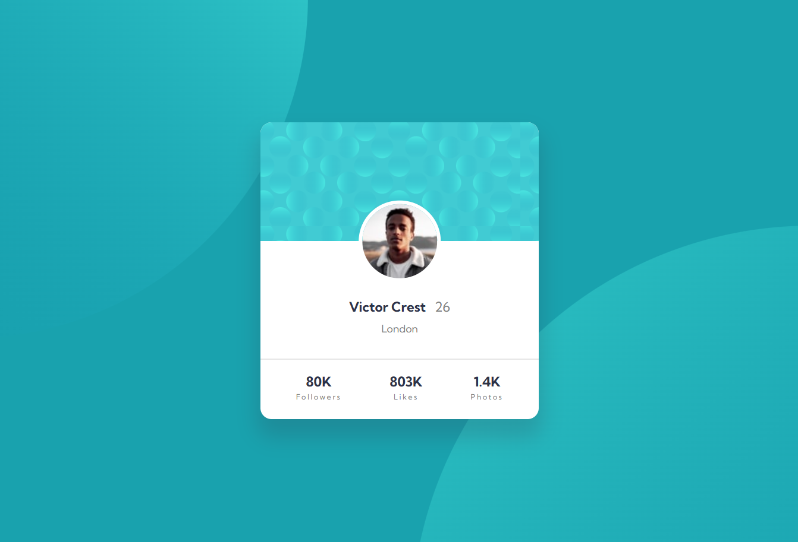

# Frontend Mentor - Profile card component solution

This is a solution to the [Profile card component challenge on Frontend Mentor](https://www.frontendmentor.io/challenges/profile-card-component-cfArpWshJ). Frontend Mentor challenges help you improve your coding skills by building realistic projects. 

## Table of contents

- [Overview](#overview)
  - [The challenge](#the-challenge)
  - [Screenshot](#screenshot)
  - [Links](#links)
- [My process](#my-process)
  - [Built with](#built-with)
  - [What i learned](#what-i-learned)
- [Author](#author)

## Overview

### The challenge

- Build out the project to the designs provided

### Screenshot



### Links

- Solution URL: [My solution](https://www.frontendmentor.io/solutions/responsive-profile-card-1Z_GWphV1L)
- Live Site URL: [Live demo](https://mohamed-devp.github.io/profile-card/)

## My process

### Built with

- Semantic HTML5 markup
- CSS custom properties
- Flexbox

# What i learned
While working in this project, i learned how to set/position multiple images using the `background-image` and `background-position` properties.

```css
body {
  background-image: 
    url("./images/bg-pattern-top.svg"),
    url("./images/bg-pattern-bottom.svg");
  background-repeat: no-repeat;
  background-position: 
      calc(50% - 35rem) calc(50% - 21rem),
      calc(50% + 32rem) calc(50% + 30rem);
  }
```

## Author

- Frontend Mentor - [@Mohamed-Devp](https://www.frontendmentor.io/profile/Mohamed-Devp)